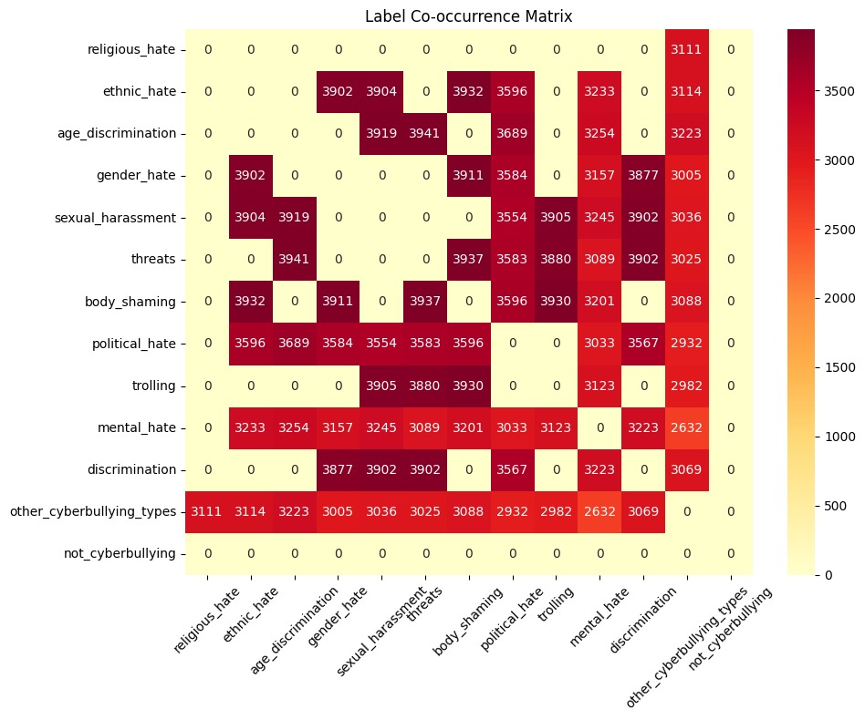

# HyBERT-X: Hybrid Feature Fusion and Transformer-based Explainable Framework for Multi-Label Cyberbullying Detection

> A multi-label cyberbullying detection framework combining handcrafted linguistic features, a novel rule-based sarcasm-scoring mechanism, and fine-tuned transformer models (HateBERT & CyberBERT) — with LIME-based explainability for transparent predictions.

---

## 📌 Overview

Cyberbullying is rarely a single, isolated behavior — a single social media post can simultaneously express **threats, body shaming, political hate, and discrimination** at once. Most existing detection systems, however, still treat this as a **binary or single-label classification problem**, which fails to capture the overlapping, multi-faceted nature of real-world abusive content.

**HyBERT-X** addresses this gap with a **multi-label classification framework** that:
- Combines traditional NLP features (BoW, TF-IDF, POS, hate-keywords) with a **custom sarcasm-detection heuristic**
- Fine-tunes **HateBERT** and **CyberBERT** transformer models for contextual, semantic understanding
- Applies **LIME (Local Interpretable Model-agnostic Explanations)** for per-label interpretability
- Is validated through **ablation studies**, **robustness analysis**, and **external cross-dataset evaluation**

---

## 🎯 Key Results

| Model | Hamming Accuracy | Precision | Recall | Micro F1 |
|---|---|---|---|---|
| **Fine-tuned HateBERT** | **95.50%** | 0.8602 | 0.6127 | **0.7156** |
| **Fine-tuned CyberBERT** | **95.50%** | 0.8612 | 0.6121 | **0.7156** |
| Multilabel SVM (proposed) | 94.18% | 0.8741 | 0.4330 | 0.5791 |
| Random Forest | 91.88% | 0.7395 | 0.1982 | 0.3126 |
| Naive Bayes | 79.03% | 0.2700 | 0.7446 | 0.3963 |
| Decision Tree | 79.68% | 0.2322 | 0.5161 | 0.3203 |

📈 The proposed **weighted sarcasm-scoring mechanism** improved Micro-F1 by **13.9%** over an equivalent uniform-weight baseline, confirming that sarcasm-aware feature design meaningfully contributes to detection performance (not just as an auxiliary handcrafted feature).

🌍 **Cross-dataset generalization**: Fine-tuned HateBERT and CyberBERT achieved **80.30%** and **80.47%** Hamming Accuracy respectively on an independent external benchmark dataset, demonstrating robustness beyond the training distribution.

---

## 🧠 Problem Statement

Given a social media text $x_i$, the goal is to predict a binary label vector $y_i \in \{0,1\}^L$ across $L = 13$ cyberbullying categories:

> Gender Hate · Ethnic Hate · Religious Hate · Threats · Body Shaming · Sexual Harassment · Political Hate · Mental Hate · Discrimination · Age Discrimination · Trolling · Other Abuse · Non-Cyberbullying

Since a single text may belong to multiple categories simultaneously, the problem is formulated as a **multi-label classification task**, solved using a **One-vs-Rest (OvR)** strategy across all evaluated models.

---

## 🏗️ Methodology

<p align="center">
  
</p>

<p align="center"><b>Dataset → Preprocessing → Hybrid Feature Engineering → Classification → Explainability</b></p>

### 1. Dataset
- **Source**: [Kaggle — Cyberbullying Dataset](https://www.kaggle.com/datasets/vikingvikas/cyberbullying-dataset)
- **Size**: 684,383 raw social media posts → 683,935 after cleaning
- **Split**: 547,148 train / 136,787 held-out test (80:20)
- For transformer fine-tuning: 200,000-sample training subset + 68,439-sample validation set, evaluated on the full held-out test set

### 2. Hybrid Feature Engineering
| Feature Group | Components |
|---|---|
| **Lexical** | Bag-of-Words, TF-IDF |
| **Syntactic** | POS Tags (NLTK) |
| **Domain-Specific** | Hate-keyword features, word-frequency features |
| **Sarcasm-Aware** | Custom rule-based heuristic sarcasm score (see below) |
| **Contextual** | Fine-tuned HateBERT & CyberBERT embeddings (768-dim) |

### 3. Sarcasm-Aware Feature Engineering (Core Contribution)
Rather than training a separate sarcasm classifier, HyBERT-X extracts **17 rule-based linguistic indicators** (sarcasm markers, sentiment contradiction, punctuation/exaggeration cues, capitalization ratio, intensifiers, quotations, emoji-text mismatch) and compresses them into a single **normalized, weighted heuristic sarcasm score**:

```
z = 2.0·mc + 1.5·ex + 2.0·cc + 1.5·𝟙[pc>0 ∧ nc>0] + 3.0·r_caps + 2.0·id + 1.5·ec
s = min(z / 10.0, 1.0)
```

This lightweight scalar score `s ∈ [0, 1]` is appended to the final feature vector, enabling implicit and sarcasm-driven cyberbullying to be captured **without the computational overhead of a dedicated sarcasm classifier**.

### 4. Models Evaluated
- **Conventional ML** (OvR multi-label): SVM, Random Forest, Decision Tree, Naive Bayes
- **Transformer-based**: Fine-tuned HateBERT, Fine-tuned CyberBERT (2 epochs, Tesla T4 GPU)

### 5. Explainability
[**LIME**](https://github.com/marcotcr/lime) is applied post-hoc to generate **per-label, per-word explanations**, showing which tokens increased or decreased the probability of each predicted cyberbullying category — critical for building trust in real-world moderation systems.

---

## 📊 Label Co-occurrence

The dataset exhibits strong overlap between cyberbullying categories (e.g., gender hate, sexual harassment, and body shaming frequently co-occur in the same text), justifying the multi-label formulation over a single-label approach.

<p align="center">
  
</p>

---

## 📊 Ablation Study

| Feature Configuration | Best Model | Micro F1 |
|---|---|---|
| Traditional Features Only (BoW+TF-IDF+POS+Hate Keywords+WordFreq) | SVM | 0.4794 |
| + Sarcasm-Aware Features | Naive Bayes | 0.8360 |
| + HateBERT + CyberBERT Embeddings (Full Framework) | SVM | **0.5791** |

---

## 🛠️ Tech Stack

- **Language**: Python 3.10+
- **NLP / Feature Engineering**: NLTK, Regex-based rule engine
- **ML**: Scikit-learn (SVM, Random Forest, Decision Tree, Naive Bayes, SVD)
- **Transformers**: HuggingFace Transformers (HateBERT, CyberBERT fine-tuning)
- **Explainability**: LIME
- **Environment**: Google Colab (Tesla T4 GPU)
- **Data Handling**: Pandas, NumPy

---

## 📁 Repository Structure

```
HyBert-X/
├── README.md
├── images/
│   ├── Workflow2 (1).png
│   ├── Co_occurence.jpeg
│   ├── lime_two_label.png
│   ├── lime_3label.png
│   └── lime_four_label.png    # LIME per-label explanation visuals
└── notebooks/
    ├── Feature extraction and model training.ipynb
    └── Finetuned_hb_and_cb.ipynb
```

> 📎 All notebooks were developed and executed on **Google Colab**. Each notebook includes an embedded "Open in Colab" link for direct, GPU-backed reproduction.

---

## 🚀 Getting Started

```bash
# Clone the repository
git clone https://github.com/Aritra2004679/HyBert-X.git
cd HyBert-X
```

Open any notebook in `notebooks/` via Jupyter or directly in Google Colab (recommended, especially for transformer fine-tuning which requires GPU access).

---

## 🔮 Future Scope

- **Fuzzy label prioritization**: Explore Type-2 Fuzzy Logic to better handle uncertainty in overlapping label predictions
- **Class imbalance handling**: Advanced sampling / cost-sensitive learning for underrepresented categories (e.g., discrimination, trolling)
- **Multimodality**: Incorporate images, emojis, and user metadata alongside text for richer context

---

## 👤 Author

**Aritra Chakraborty**
B.Tech Computer Science, Techno India University
[LinkedIn](https://www.linkedin.com/in/aritra-chakraborty-b633a6284) · [GitHub](https://github.com/Aritra2004679)
